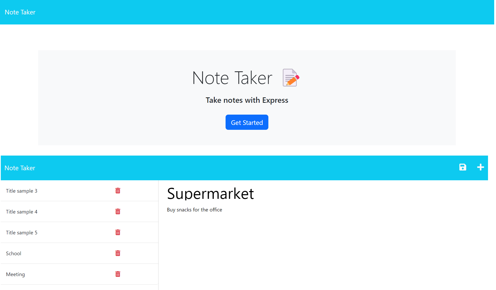

# Note Taker

# Description

This application had a starter code with all the front end functionality completed. I used Express() and the functions get, post, and delete to create a communication between the website and my own server. This application is a Note Taker that saves, visualizes, and deletes notes from a server.

# Table of Contents

- [Installation](#installation)
- [Usage](#usage)
- [Questions](#questions)
- [License](#license)

# Installation
I installed express using npm i express in the terminal. I also installed uuid to create the ID's for the notes.

# Usage

This application creates, visualizes, and deletes notes from a server. You are able to see a display of all the notes through a website.

Link to the deployed application [Note Taker Application](https://quiet-shore-39032.herokuapp.com/)

# Questions
Link to my github profile [Github](https://github.com/ginitadavis/)
If you have any questions, you can reach me via email at gina.vera.davis@gmail.com

# License

    